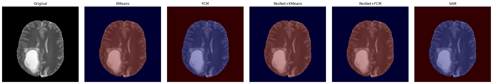

# Image Segmentation with Unsupervised and Pretrained Models

Here in this repo we try to segment some images using 3 types of methods:

## Unsupervised Segmentation
Segment all images using the following algorithms:
- **Fuzzy C-Means**
- **K-Means**

## Feature-Based Segmentation

Using a **pretrained ResNet model** (or any other suitable method):
- Extract **feature maps** from the input images.
- Resize these maps using **interpolation** or another technique to match the original image size.
- Concatenate the resized feature maps with the original image as input.
- Apply **Fuzzy C-Means** and **K-Means** segmentation again using this augmented input.

## Segmentation with SAM Model

Use the **pretrained SAM (Segment Anything Model)** to perform image segmentation on the same dataset.

## Results

    
    
    

